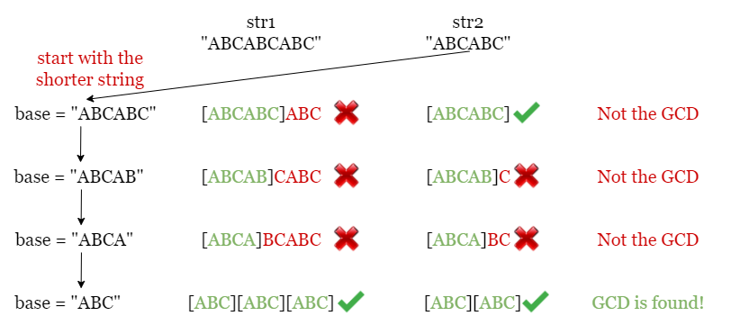
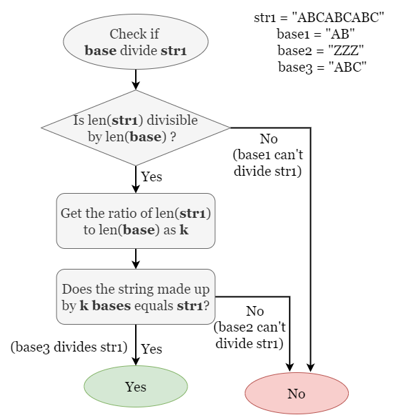
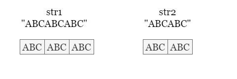

# Greatest Common Divisor of Strings

For two strings s and t, we say "t divides s" if and only if s = t + ... + t (i.e., t is concatenated with itself one or
more times).

Given two strings str1 and str2, return the largest string x such that x divides both str1 and str2.

```plain 

Example 1:

Input: str1 = "ABCABC", str2 = "ABC"
Output: "ABC"
Example 2:

Input: str1 = "ABABAB", str2 = "ABAB"
Output: "AB"
Example 3:

Input: str1 = "LEET", str2 = "CODE"
Output: ""
```

## Solution

### Approach 1: Brute Force

#### Intuition

We start by introducing a brute force method that checks every possible string until we find the GCD string. Before we
do that, let's clarify a few things:

> What are the possible candidate strings?

Here we make use of prefix strings. If a string base is the GCD string, it must be a prefix of both str1 and str2. So
instead of trying every combination of characters, we instead just take each prefix string of str1 (or str2) and check
if it is the GCD string.

> What is the order we should check in?

As the problem indicates that we should look for the greatest common divisor string (longest length), we should start
with the longest possible prefix string, which is the shorter string between str1 and str2 (any longer string is
guaranteed not to be a divisible string since it will be longer than at least one string). If the current base is not
valid, we can check the next shorter prefix by removing the last character from base.



> How to verify if base is the GCD string?

If base is the GCD string, then both str1 and str2 are made up of multiples of base, so we just need to check if str1
and str2 can be made up of multiple base concatenations. We first check if the length of str is divisible by the length
of base. If so, we multiply base by the number of times the lengths divide and check if the made-up string equals str.



#### Algorithm

1. Find the shorter string among str1 and str2, without loss of generality, let it be str1.
2. Start with base = str1, and check if both str1 and str2 are made of multiples of base.
    - If so, return base.
    - Otherwise, we shall try a shorter string by removing the last character from base.
3. If we have checked all prefix strings without finding the GCD string, return "".

#### Complexity Analysis

Let m,n be the lengths of the two input strings str1 and str2.

- Time complexity: `O(min(m,n)⋅(m+n))`:

  We checked every prefix string base of the shorter string among str1 and str2, and verify if both strings are made by
  multiples of base. There are up to min⁡(m,n)\min(m, n)min(m,n) prefix strings to verify and each check involves
  iterating over the two input strings to check if the current base is the GCD string, which costs O(m+n)O(m + n)O(m+n).
  Therefore, the overall time complexity is O(min⁡(m,n)⋅(m+n))O(\min(m, n) \cdot (m + n))O(min(m,n)⋅(m+n)).


- Space complexity: `O(min(m,n))`.

  We need to keep a copy of base in each iteration, which takes O(min⁡(m,n))O(\min(m, n))O(min(m,n)) space.

---

### Approach 2: GCD

#### Intuition

Here is a more mathmatical approach to the problem. Note that this approach is more advanced/elegant

#### Algorithm

##### How to verify if there exists any divisible string?

Suppose there exists a divisible string base, we can write str1 and str2 in the form of multiples of base. Take the
following picture as an example.



Since both strings contain multiples of the identical segment base, their concatenation must be consistent, regardless
of the order `(str1 + str2 = str2 + str1)`.


Therefore, we need to check if two concatenations made by str1 and str2 in both orders are the same. If they are not
consistent, it means there is no divisible strings and we should return "" as required. Otherwise, there exists a GCD
string of str1 and str2.

##### If there are divisible strings, what is the length of the GCD string?

We focus on the substring gcdBase whose length equals the greatest common divisor of the lengths of str1 and str2 (take
the above picture as an example, the lengths of str1 and str2 are 9 and 6, so we focus on the substring of length 3,
which is gcdBase = ABC). We will show that if there exists divisible strings, then the gcdBase must be the GCD string.

For convenience, we refer to the length of str1, str2 and gcdBase as m, n, gcdLength respectively.

> Is it possible for the GCD string to be shorter than gcdBase?

No. We can prove it by contradiction. Assume that a string shorterBase is shorter than gcdBase (shorterLength <
gcdLength, and gcdBase is not the GCD string).

- shorterBase is a divisible string, thus shorterLength is a divisor of m and n.
- Since gcdLength is the greatest common divisor of m and n, gcdLength is divisible by shorterLength.
- Both str1 and str2 contains multiples of gcdBase, so gcdBase is also a divisible string, which means that the GCD
  string is at least as long as gcdBase.
- Therefore it is not possible for the GCD string to be shorter than gcdBase.

Let's look at the following example where gcdBase = ABCABC. Note that we are not sure if gcdBase is the GCD string yet.


There exists a shorter substring shorterBase = ABC which divides both str1 and str2. Can this divisible string be the
GCD of strings?


Both str1 and str2 contain multiples of shorterBase.


Recall that the length of gcdBase is the GCD of the lengths of str1 and str2, thus it is divisible by the length of
shorterBase.


Since gcdLength is a divisor of both m and n, both str1 and str2 contain multiples of gcdBase, thus gcdBase is also a
divisible string.


We have shown that if there is a shorter string that divides both str1 and str2, then gcdBase is also a divisible
string, so a divisible string shorter than gcdBase can never be the GCD string.

> Is it possible for the a string longer than gcdBase to be divisible, and thus gcdBase is not the GCD string?

No. Assume that there exists a string longerBase that is a divisible string with length longerLength > gcdLength,

- Since longerBase is a divisible string, its length longerLength must be a divisor of m and n.
- This contradicts the assumption that gcdLength is the GCD of m and n.
- Therefore there doesn't exist a divisible string longer than gcdBase.

In conclusion, if there exists divisible strings, the GCD string must be gcdBase.

#### Complexity Analysis

##### Time Complexity `O(m+n)`

- We need to compare the two concatenations of length O(m+n), it takes `O(m+n)` time.
- We calculate the GCD using binary Euclidean algorithm, it takes `log(m⋅n)` time.
- To sum up, the overall time complexity is `O(m+n)`.

##### Space Complexity `O(m+n)`

We need to compare the two concatenations of length `O(m+n)`.

---

## Related Topics

- String
- Math
